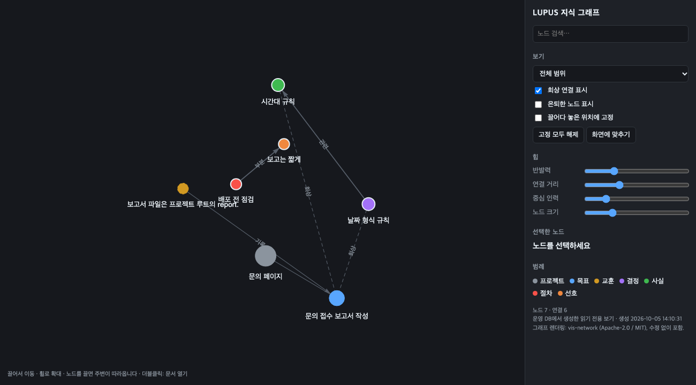

<div align="center">


# LUPUS

**AI WORKS TOGETHER**

### 让 Claude Code 与 Codex CLI 把可验证的工作真正做完的本地 supervisor —<br/>以证据判定完成 · 预算 · 崩溃恢复 · Claude ↔ Codex 交接

[English](./README.md) · [한국어](./README.ko.md) · [简体中文](./README.zh-CN.md) · [日本語](./README.ja.md)

[](./LICENSE)


</div>

Lupus 把你已经安装并登录的 `claude` 和 `codex` CLI（沿用现有订阅登录）作为 worker 来运行，而“完成”由它自己判定：只有 worker 无法左右的检查通过，目标才算完成；模型说“做完了”不算。

**当前为 `v0.2 alpha`。** 这是 macOS 上的单用户工具。worker 和验证器在操作系统沙箱中运行，但不是虚拟机。下面的测量规模很小。请勿用于敏感资料。

## 功能

| | |
|---|---|
| **只凭证据完成** | DONE 需要与当前验收条件绑定的检查通过。worker 的“我修好了”不是证据。 |
| **冻结测试** | worker 启动前冻结测试文件和运行器配置。被修改、删除或跳过的测试会在验证前恢复。 |
| **Python、Node、Go、Rust，或任意命令** | 仅凭项目文件识别 unittest、pytest、node:test、jest、vitest、`go test`、`cargo test`。其他情况用 `--check "<你的测试命令>"`。 |
| **任何请求一行搞定** | `lupus fix-tests` 把它自己观测到的失败作为目标。`lupus do "<请求>"` 在一次调用中起草一个失败的测试和（单独存放的）实现方案；你批准测试后，方案才被应用并验证。 |
| **文档、规划、调研** | `lupus write`：先由你批准评判标准；由另一个 AI 评判，每认可一项都必须引用文档原文；最后由你对该版本签字确认。 |
| **你平时的交互式会话** | `lupus session` 按你自己的配置启动平时的 `claude` / `codex` 界面，冻结测试，并在你退出时自行验证。 |
| **Claude ↔ Codex 交接** | 一方停下（额度、中断、你的选择）时，另一方从经过验证的 checkpoint 继续。已完成的步骤不重做，预算和尝试次数不清零。 |
| **多个项目、后台运行** | `lupus alpha-run` 在共享预算下轮流推进所有未完成的目标，并在某个 AI 额度用尽时切换到另一个。`--background` 让它在终端关闭后继续运行。 |
| **预算与循环控制** | 调用、尝试、时间和 token 在开始前预留。重复同一个失败的尝试会在调用模型之前被拒绝。 |
| **崩溃安全的 checkpoint** | 恢复对象先于数据库提交持久化；已在每个边界处杀进程测试。 |
| **你的工作区保持原样** | `--isolated` 在已提交 HEAD 的独立检出中工作。`lupus diff` 查看结果，`lupus accept` 以一个提交带回（仅快进，并对该提交本身再次检查），`lupus discard` 丢弃。 |
| **操作系统级约束** | Claude worker 和所有验证器都在 Lupus 施加的 macOS 沙箱中运行；验证器也可以改在 Docker 容器中运行。 |
| **必须证明自己价值的记忆** | 项目知识以带类型、带链接的节点保存。`lupus learn` 从记录下来的失败中提出做法，在后续经过验证的结果将其晋升或淘汰之前，它们一直是候选。 |

## 在一台 Mac 上的测量（2026-10-06）

相同任务、相同检查、每次运行使用全新目录，每格 3 次，全部通过。Claude Code 2.1.290，codex-cli 0.160.0。token = 新输入 + 缓存输入 + 输出，为 3 个任务之和、3 次运行的平均值。

| 3 个一次性编码任务 | 按你当前配置的 CLI | 同一 CLI，关闭插件/MCP | Lupus |
|---|---|---|---|
| Claude | 400,640 token · 53.9 s | 55,290 · 33.5 s | **37,216 · 18.0 s** |
| Codex | 244,458 token · 58.7 s | 203,780 · 50.6 s | **107,931 · 28.5 s** |

| 其他情形 | 不用 Lupus | Lupus |
|---|---|---|
| 4 步项目，Claude（1–2 次，2026-10-05） | 298,327 token · 52.0 s | 70,768 · 42.5 s |
| 同一项目中断后由另一个 AI 接手（2026-10-05） | 337,133 token · 82.0 s · 重新说明 1,139 字符 | 138,989 · 64.1 s · 无需 |
| 4 步项目，Codex，每步一次调用 对比 合并调用 | 185,278 token · 89.0 s | 122,595 · 53.1 s |
| 用 `lupus do` 处理功能请求 对比 一次普通调用，Claude（3 次，2026-10-07） | 17,493 token · 10.1 s | **15,629 · 15.1 s** |
| 同上，Codex（3 次，2026-10-07） | 72,083 token · 24.4 s | **37,502 · 24.8 s** |

**在真实项目上。** 选取 [hukkin/tomli](https://github.com/hukkin/tomli) 维护者实际做过的 3 处改动（一个缺陷修复、一个 TOML 1.1 功能、一处加固）：源码取该提交之前的状态，测试取提交之后的状态，除此之外什么都不给。`lupus fix-tests` 用 Claude（36k–64k token，10–21 秒）和 Codex（82k–119k token，16–21 秒）都在第一次尝试就完成了全部 3 项，由上游测试判定，没有任何一次运行试图修改这些测试。

**它能把更多请求做对吗？现在与普通调用持平，但并不更好。** 取自 5 个项目（sqlparse、more-itertools、tomli、packaging、click）的 20 个真实上游提交：worker 只拿到提交之前的仓库和提交说明；上游测试被隐藏并用于评分。`lupus do` 起草的检查被自动批准，这并不是它的正常用法。

| 隐藏的上游测试通过数（2026-10-07，同一次运行中一并测量） | 普通调用 | `lupus do` |
|---|---|---|
| Codex，20 个 | 13 | 13 |
| Claude，前 12 个 | 10 | 11 |
| 同一天、下述修复之前：Codex 20 个 / Claude 7 个 | 13 / 7 | 11 / 4 |

此前落后有一个测量到的原因。`lupus do` 让 worker 把实现方案以完整文件写到一个单独的文件夹里；遇到大文件时这会超出时间限制（more-itertools 的 2 个：850 秒，失败）。现在 worker 直接就地修改源码，Lupus 先把这些修改取出，在此状态下判定测试并展示给你，待你批准后再放回去。同样的 2 个现在用 54 秒和 100 秒通过。不过 `lupus do` 仍比普通调用更耗时（每个、不含可选的评审：Codex 77 秒对 55 秒，Claude 85 秒对 46 秒）。

当 Lupus 报告 DONE 时，隐藏测试失败的情况仍有：Codex 18 次中 7 次，Claude 10 次中 1 次（这 8 次里有 7 次普通调用也失败了）。**DONE 表示你批准的检查通过了，并不表示请求被正确理解。** 反过来，有 4 次隐藏测试通过而 Lupus 报告“未完成”；这 4 次都是因为请求要改变项目现有测试所固定的行为，而这些测试是被冻结的。

**独立评审在这里没有帮助。** `lupus do --review` 在检查通过后让另一个 AI 对照请求与改动（每条异议都必须原样引用请求；异议只退回给 worker 一次；破坏已批准检查的修改会被撤销）。在评审的 28 个结果中，它提出异议 2 次，改变隐藏测试结果 0 次；在 8 个错误的结果中它只对 1 个提出了异议，随后的修改也没有把它改对。它默认关闭，效果未经证实。

**评判文档。** 缺少一项标准内容的文档，以及指示评判者放行的文档，两个评判者都予以拒绝；完整的文档被接受（6 项中 6 项符合预期，各 1 次）。

请如实看待这些数字：

- **相对于“按你当前配置的 CLI”，节省主要来自不加载插件、MCP 服务器和技能说明**，这一点不用 Lupus 也能做到（中间一列）。Lupus 在此之上增加的是 prompt 技巧和验证。
- **`lupus do` 现在只调用一次模型，而不是两次。** 测试和实现方案来自同一次调用，方案被单独存放；测试针对当前代码进行检查并展示给你，只有在你批准之后方案才会被应用并验证。这使它在 Claude 上从 29,104 降到 15,629 token，在 Codex 上从 74,245 降到 37,502 token，token 数低于一次普通调用。不过在 Claude 上它仍比普通调用慢（15.1 秒对 10.1 秒），并且因为输出 token 占比更高，按标价估算的费用约为 1.6 倍（订阅并不按 token 计费）。所有条件下 holdout 测试都通过了；`--two-step` 可恢复原来的做法。
- 在本次测量中，`--cheap-first` 在 Claude 上没有节省 token（107,738 对 37,216）。
- 每格 3 次、一台机器、小任务。第一张表的耗时是在同时有其他 CLI 调用运行的情况下测得的。
- 在 3 个带隐藏 holdout 测试的更难任务上（2026-10-05），无论是否使用 Lupus，36 次运行全部通过，因此该基准无法证明冻结测试能减少虚假完成。

原始数据与脚本：[`lupus/docs/`](./lupus/docs) · [`lupus/evaluations/`](./lupus/evaluations) · 完整记录见 [docs/design/LUPUS-IMPLEMENTATION-REVIEW.md](./docs/design/LUPUS-IMPLEMENTATION-REVIEW.md)（韩语）。

## 何时使用，何时不用

**适合使用**：失败的测试；值得用一个你读过的检查来确认的功能开发；可能被中断或需要在 Claude 与 Codex 之间切换的多步或长时间任务；应当由作者之外的一方来评判的文档；以及你希望测试不被改动的交互式会话。

**用普通 CLI 更好**：一次性提问和快速探索——在这些场合 Lupus 只会增加步骤。

**它不能替代**：集成在编辑器里的助手（Cline、Cursor）、拥有自己的智能体循环和广泛模型选择的工具（Aider、OpenHands），以及多智能体工作区（Claude Squad、claude-flow）。Lupus 是 macOS 上面向有明确边界的 Claude Code / Codex 任务的监督器：可复现的检查、可审阅的改动、中断恢复。

## 快速开始

要求：macOS；Python **3.12+**，且其 SQLite 为 **3.51.3+ 并带 FTS5**（Homebrew 的 Python 即可）；已安装并登录 `claude` 和/或 `codex`。

```bash
git clone https://github.com/djfksjd/lupus.git
cd lupus/lupus
python3 -m pip install -e .          # 或：export PYTHONPATH=src 后使用 `python3 -m lupus`

lupus init                           # 创建 ~/.lupus（数据库 + vault）
lupus probe --live                   # 测量已安装 CLI 的实际支持范围（2 次很小的调用）

cd ~/work/my-project
lupus fix-tests --driver claude      # 观测失败 -> 冻结测试 -> 修复 -> 验证
lupus do "给 export 命令增加 --json 选项" --driver claude
                                     # 一次调用：失败的测试 + 单独存放的方案 -> 你批准测试 -> 应用并验证
lupus do "…" --driver claude --review     # 检查通过后，由另一个 AI 对照请求与改动（可选；见上面的试验）
lupus do "…" --driver claude --isolated   # 同样的流程，在独立检出中进行；之后：lupus diff | accept | discard <goal>
lupus session --driver claude        # 你平时的交互式 Claude Code，测试已冻结，退出时验证
lupus write "账单表迁移计划" --out docs/plan.md --driver claude
                                     # 你批准标准 -> 撰写 -> 另一个 AI 评判 -> 你签字
```

多个目标，无人值守：

```bash
lupus alpha-budget --calls 300 --attempts 40 --minutes 600     # 为所有工作设一个上限
lupus alpha-run --drivers claude,codex --background            # 轮流推进所有未完成目标；额度用尽时切换 AI
lupus jobs        # 正在运行的任务          lupus logs <job>        lupus stop <job>
lupus alpha-status                                             # 所有项目一览
lupus learn --driver claude                                    # 从记录的失败中生成候选做法
```

用你自己的检查定义目标、其他语言、容器、知识图谱以及全部命令：[`lupus/README.md`](./lupus/README.md)（韩语）。

## 工作原理

```text
 you ──► goal + acceptance checks ──► ┌──────────────── Lupus supervisor (plain program) ───────────────┐
                                      │ budget · attempts · leases · checkpoints · frozen tests · memory │
                                      └───────┬───────────────────────────────────────────────┬─────────┘
                                   lean prompt│                                               │verify (deterministic)
                                              ▼                                               ▼
                                   claude  ◄──handoff──►  codex                    PASS evidence ──► DONE
```

- supervisor 是普通程序。路由、预算、重试和完成都不由模型调用决定。
- worker 只得到 prompt 和一个目录，拿不到数据库、CLI 或任何权限。
- 不修改任何全局设置：不改 PATH，不动 `~/.claude` 和 `~/.codex`。`lupus session` 的钩子只传给那一个进程。

<div align="center">

<br/><sub>知识图谱视图（<code>lupus graph</code>）：节点、类型化链接，以及知识被记录和被召回的目标</sub>
</div>

## 需要了解的限制

- **它不会让模型更聪明。** 以隐藏测试衡量，它与普通调用持平而不是更好，另一个 AI 的独立评审也没有改变结果（见上面的试验）。它给你的是：按你同意的方式检查过的结果、不在你工作区里进行的工作，以及中断后可以继续的进度。
- **不是虚拟机。** Claude worker 和验证器在 macOS 沙箱中运行（主目录中除 CLI 自身所需之外都不可读，项目和临时目录之外不可写，Lupus 自身的状态不可触及）；Codex 使用它自己的沙箱，配置由 Lupus 设定；验证器可以使用 Docker。临时目录是共享的，worker 的网络是开放的，交互式会话则完全不在沙箱内。不要把受保护的资料或客户资料交给它。
- **需要你来启动。** `lupus session` 包裹你的交互式 CLI；你自己直接输入 `claude` 时 Lupus 不会介入。CLI 不报告交互式会话的 token 用量，因此按预留的全额计费。
- **评判者给出的是意见。** 引用检查能挡住没有依据的放行，挡不住错误的事实。所以你的签字是最后一个条件。图片和视觉设计无法评判。
- **测试是由被测代码运行的。** 输出解析能抵御意外和廉价的把戏；但在测试进程内部蓄意伪造运行器整段汇总的代码，Lupus 无法察觉。位于源文件内的 Rust 单元测试无法冻结（名称被固定，函数体没有）。
- **一次只有一个 worker。** `alpha-run` 轮流处理目标，不会并行运行多个项目。
- 学习功能只提出候选，由后续经过验证的结果来决定；没有固定的评估集，也没有接入 Prime 本身。
- jest 和 vitest 用真实安装验证过；Go 和 Rust 用为验证临时安装的工具链验证过。Linux 和 Windows 上没有操作系统沙箱支持。
- 任何等待状态都有出路：`lupus status <goal>` 说明原因，再用 `resolve`、`refreeze`、`approve`、`revise`、`revalidate`、`budget-raise` 继续。`lupus prune` 清理旧的遗留文件。
- 代码还很年轻。17 轮外部评审发现了 118 个缺陷并修复了其中 117 个，一次可用性审查又发现并修复了 16 个，应当假定仍有遗漏。

## 文档

- [机器契约](./lupus/docs/CONTRACT.md) — 代码强制执行的规则，以及范围之外的内容（韩语）
- [实现记录](./docs/design/LUPUS-IMPLEMENTATION-REVIEW.md) — 决策、评审、所有测量及其局限（韩语）
- [设计](./docs/design/LUPUS-PLAN.md) — 完整设计（韩语）
- [第三方声明](./lupus/THIRD_PARTY_NOTICES.md) — 图谱视图原样打包了 vis-network

## 许可证

[Apache-2.0](./LICENSE)。打包的 vis-network 按 MIT 许可使用。
